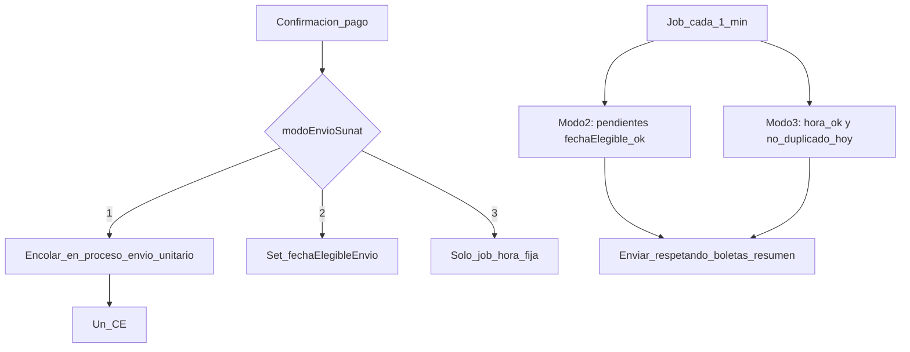

# Plan: envío SUNAT con tres modos (todo en base de datos)

## Principios

- **Estado y horarios en SQL Server** (no Redis para programación ni reintentos).
- **Simple**: un job Node que corre cada 1 minuto (o cada minuto comercialmente aceptable) consulta la BD y ejecuta envíos; **concurrencia limitada en código** (p. ej. secuencial por empresa o semáforo en memoria) para no saturar SUNAT.
- Reutilizar donde sea posible: `[listarPendientesEnvioRepo](backAppC/repositories/facturacion.repository.js)`, `useResumenDiarioBoletas`, `[enviarLotePendientesService](backAppC/services/facturacion.service.js)` / envío unitario.

---

## 1) Nuevos campos en base de datos

### A) `ConfiguracionFacturacionElectronica` (por empresa)

| Columna                 | Tipo                       | Uso                                                                                                                                                                                                                         |
| ----------------------- | -------------------------- | --------------------------------------------------------------------------------------------------------------------------------------------------------------------------------------------------------------------------- |
| `modoEnvioSunat`        | TINYINT NOT NULL DEFAULT 2 | **1** = inmediato al confirmar pago; **2** = diferido 10 min (lotes); **3** = hora fija diaria.                                                                                                                             |
| `horaEnvioSunat`        | TIME NULL                  | Solo modo 3: hora local (documentar TZ, p. ej. `America/Lima`). NULL en modos 1 y 2.                                                                                                                                        |
| `intervaloMinutosEnvio` | INT NOT NULL DEFAULT 10    | Modo 2: minutos tras confirmación de pago antes de ser elegible para lote (por defecto 10). Puede mapearse desde UI reutilizando el actual `minutosEnvioAutomatico` **o** nueva columna si queréis no reutilizar el nombre. |

**Nota**: Si preferís no duplicar, se puede usar solo `minutosEnvioAutomatico` existente como intervalo del modo 2 y añadir solo `modoEnvioSunat` + `horaEnvioSunat`. El plan recomienda **mínimo 2 columnas nuevas**: `modoEnvioSunat`, `horaEnvioSunat`; intervalo modo 2 = `minutosEnvioAutomatico` (default 10).

Campos existentes que siguen aplicando:

- `envioAutomatico`: maestro ON/OFF para modos 2 y 3 (y puede ignorarse en modo 1 si el disparo es solo por evento de pago).
- `envioDirectoSunat` / Facturador: sin cambios.
- `useResumenDiarioBoletas`: define boletas vía resumen diario vs envío individual en flujos ya actuales.

### B) `ComprobantesElectronicos` (por documento)

| Columna                   | Tipo                   | Uso                                                                                                                                                                               |
| ------------------------- | ---------------------- | --------------------------------------------------------------------------------------------------------------------------------------------------------------------------------- |
| `fechaConfirmacionPago`   | DATETIME2 NULL         | Momento en que la venta/comprobante quedó “pagado confirmado” (seteado desde el mismo flujo que hoy marca pago).                                                                  |
| `fechaElegibleEnvio`      | DATETIME2 NULL         | Modo 2: `fechaConfirmacionPago + intervalo` (calculado al confirmar pago). El job solo procesa `idEstadoSunat = 7` y `fechaElegibleEnvio <= GETUTDATE()` (o hora local acordada). |
| `intentosEnvio`           | INT NOT NULL DEFAULT 0 | Cada intento de envío a SUNAT (éxito o error según política).                                                                                                                     |
| `maxIntentosEnvio`        | INT NULL               | NULL = usar default global en código o en configuración empresa; opcional.                                                                                                        |
| `fechaUltimoIntentoEnvio` | DATETIME2 NULL         | Anti re-bombardeo: no reintentar el mismo comprobante antes de X minutos si falló (backoff simple en job).                                                                        |

**Alternativa más mínima**: si no queréis tocar `ComprobantesElectronicos` al máximo, `fechaConfirmacionPago` puede vivir en `Ventas` (una sola vez por venta) y el CE hereda al generarse; para modo 2 igual necesitáis saber cuándo “entró al bucket” de envío — o calcular en job `Ventas.fechaConfirmacionPago + intervalo`. La opción más clara operativa es **columnas en CE** una vez generado el comprobante.

---

## 2) Los tres modos (comportamiento)

### Modo 1 — Envío individual inmediato

- **Disparo**: al **confirmar el pago** (mismo punto del backend donde hoy actualizáis estado de pago / venta), si `modoEnvioSunat = 1` y comprobante electrónico existe en estado pendiente (`idEstadoSunat = 7`), llamar **asíncrono** (no bloquear la respuesta HTTP) a envío de **ese** `idComprobanteElectronico` con credenciales de la empresa.
- **Reintentos**: si falla, incrementar `intentosEnvio`, guardar error, aplicar **backoff** (p. ej. próximo intento solo vía job nocturno o campo `fechaProximoReintento` — si queréis mantener todo en BD, añadir `fechaProximoReintento DATETIME2 NULL`).

### Modo 2 — Cada N minutos (default 10) tras confirmación de pago, en lote

- Al confirmar pago: setear `fechaConfirmacionPago`, calcular `fechaElegibleEnvio = fechaConfirmacionPago + intervaloMinutosEnvio` (desde config empresa).
- **Job** (cada 1 min): por cada empresa con `envioAutomatico = 1` y `modoEnvioSunat = 2`, listar pendientes `idEstadoSunat = 7` y `fechaElegibleEnvio <= ahora`.
- **Facturas (01)**: enviar en lote (mismo criterio que hoy: excluir boletas si aplica resumen) — reutilizar `listarPendientesEnvioRepo` con `excluirBoletas: true` cuando `useResumenDiarioBoletas`.
- **Boletas (03)**: **igual que configuración actual**: si `useResumenDiarioBoletas`, **no** mezclar en este lote de envío directo de boletas; siguen al flujo de resumen diario existente; si no, incluir en envío como hace hoy el servicio.

### Modo 3 — Hora fija en configuración

- **Job** cada 1 min: para empresas con `modoEnvioSunat = 3` y `envioAutomatico = 1`, si la **hora actual** (en TZ definida) coincide con `horaEnvioSunat` (ventana de 1 minuto), ejecutar **una ola** de envío de todos los pendientes elegibles (misma regla factura/boleta/resumen que modo 2).
- Evitar doble ejecución el mismo día: columna en config `**fechaUltimaOlaEnvioProgramado DATE NULL`** o tabla pequeña `EmpresaEnvioSunatLog (idEmpresa, fecha, tipoOla)` — una fila por día por empresa para modo 3.

---

## 3) Backend (archivos a tocar, sin Redis)

- **Migración** en `backAppC/migrations/*.sql`.
- **Repository**: extender `obtenerConfiguracionFacturacionRepo` / `actualizarConfiguracionFacturacionRepo` con nuevos campos; métodos para listar CE elegibles por modo 2/3; actualizar intentos/fechas.
- **Service**: 
  - función `enviarUnComprobanteSiPendiente(pool, idEmpresa, idComprobanteElectronico)` para modo 1;
  - refactor job actual `[envioSunat.job.js](backAppC/jobs/envioSunat.job.js)` → tick lee empresas y aplica modo 2 y 3;
  - hook en servicio de **confirmación de pago** (ubicar el método existente que marca pago confirmado) → modo 1 y cálculo de `fechaElegibleEnvio` para modo 2.
- **Controller facturación**: exponer nuevos campos en GET/PUT configuración.

---

## 4) Frontend

- En `[index-configuracion](adminSPA/src/app/components/configuracion/index-configuracion/)`: radio o select **Modo de envío SUNAT** (1 / 2 / 3), campo **Hora** visible solo si modo 3, **Minutos de espera** visible si modo 2 (bind a `minutosEnvioAutomatico` o `intervaloMinutosEnvio`).

---

## 5) Comprobantes rechazados

- Se mantiene la recomendación del plan anterior: **listado dedicado** o filtro por `idEstadoSunat` + descripción SUNAT; independiente de los tres modos.

---

## 6) Diagrama lógico

---

## 7) Qué se descarta respecto al plan anterior

- **No** usar Redis/BullMQ para estado de horarios ni reintentos (opcional en el futuro solo si escaláis a varios nodos y necesitáis cola distribuida; entonces la BD seguiría siendo fuente de verdad y Redis sería ayuda mecánica).

Este documento **sustituye** la orientación “colas Redis” del plan previo; la eficacia frente a SUNAT se logra con **menos paralelismo en el worker**, **ventanas de tiempo** y **límites de reintentos** en columnas SQL.