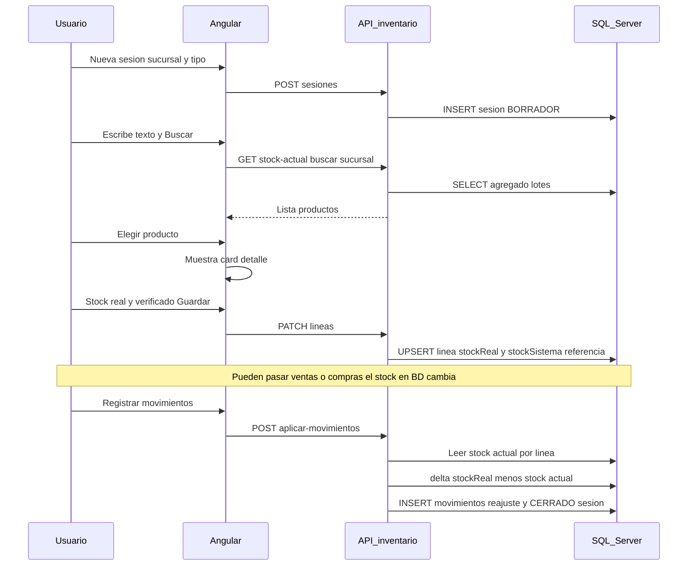

# Plan: Conteo de inventario físico (inicial y mensual)

Documento de diseño para implementar un flujo de **inventario físico** alineado con la imagen de referencia: búsqueda en catálogo, tabla de coincidencias, acción **Elegir**, y detalle con **stock en sistema**, **stock real (físico)** y marca **verificado**.  
Versión acordada para la **primera entrega:** búsqueda **solo por API** (catálogo / stock agregado), **sin** importación Excel.

---

## 1. Objetivo de negocio

| Necesidad | Descripción |
|-----------|-------------|
| Inventario inicial | Primera toma física o carga controlada al arrancar operaciones en una sucursal. |
| Inventario mensual | Conteos periódicos para detectar diferencias sin depender solo del stock teórico. |

El sistema debe permitir:

1. Crear una **sesión de conteo** (cabecera): empresa (JWT), sucursal, tipo `INICIAL` o `MENSUAL`, fechas/observaciones, estado.
2. **Buscar** productos por texto (código, descripción, marca, categoría, etc.) y mostrar resultados en **tabla**.
3. Pulsar **Elegir** en una fila y ver un **card de detalle** con datos del producto y campos de conteo: stock sistema (lectura), stock real (editable), checkbox **verificado**.
4. **Guardar** la línea en la sesión (sin duplicar el mismo producto en la misma sesión, salvo que se defina “reconteo” en una fase posterior).
5. Cuando el usuario decida **registrar los movimientos**, el sistema calcula las diferencias y genera **reajustes positivos o negativos** (o fases: primero solo borrador, luego este paso).

Las fases de exportación o permisos extra se pueden añadir después; lo crítico para tu duda de **stock que cambia entre borrador y cierre** está resuelto en la sección **3**.

---

## 2. Proceso del plan (explicación paso a paso)

### 2.1 Qué es el borrador

- **`InventarioFisicoSesion`**: una “carpeta” de trabajo (sucursal, tipo INICIAL/MENSUAL, estado `BORRADOR` o `CERRADO`).
- **`InventarioFisicoLinea`**: una fila por producto contado en esa sesión, con el **stock físico declarado** (`stockReal`), si está **verificado**, y opcionalmente un **valor de referencia** del stock en sistema en el momento en que guardaste (auditoría).

Mientras la sesión está en **BORRADOR**, puedes buscar productos, **Elegir**, cambiar `stockReal` (ej. de 11 a 12), marcar verificado, etc. **No se mueven lotes** todavía.

### 2.2 Cómo se relaciona con reajuste positivo / negativo

Se compara lo que **debe quedar reflejado en sistema como cantidad física** (lo que tú declaras en `stockReal`) con lo que **el sistema tiene ahora** en esa sucursal (stock agregado por lotes, igual que “Stock actual”).

- Si **stock en sistema = 10** y **en físico cuentas 8** → el libro debe **bajar 2** → se trata de una **salida / reajuste negativo** (según cómo esté mapeado en `inventario.service.js`: `REAJUSTE_NEGATIVO` o `SALIDA_MERMA` según reglas de negocio que fije el equipo).
- Si **stock en sistema = 10** y **cuentas 12** → el libro debe **subir 2** → **reajuste positivo** (`REAJUSTE_POSITIVO` / entrada de ajuste).

La **cantidad del movimiento** no es “memoria del primer conteo”, es la **diferencia necesaria hoy** para igualar el libro a tu `stockReal` declarado (ver sección 3).

### 2.3 Orden operativo recomendado

1. **Crear sesión** (borrador).
2. **Buscar** productos (API stock/catálogo).
3. **Elegir** → card → cargar **stock sistema actual** solo para mostrar; ingresar **stock real** y **verificado**.
4. **Guardar línea** → persiste en `InventarioFisicoLinea` (puedes **editar** `stockReal` cuantas veces quieras en borrador).
5. Repetir para más productos.
6. **Registrar movimientos** (acción explícita): el backend, en **una transacción**, para cada línea verificada (o todas, según regla):
   - Lee **stock sistema actual** otra vez.
   - Calcula `delta = stockReal - stockSistemaActual`.
   - Si `delta < 0` → movimiento de **baja** por `|delta|`.
   - Si `delta > 0` → movimiento de **subida** por `delta`.
   - Si `delta = 0` → omitir o registrar “sin ajuste”.
7. Marcar sesión **`CERRADO`** y bloquear edición de líneas.

---

## 3. Tu duda: “Si el stock en sistema ya no es 10 al registrar, ¿el ajuste deja de ser real?”

**Correcto: si usáramos solo el snapshot “cuando guardé en borrador había 10”, el movimiento podría ser incorrecto** después de ventas, compras u otros movimientos.

Por eso el plan se reformula así:

### 3.1 Regla de oro al **registrar movimientos**

> **La cantidad ajustada se calcula al momento de aplicar:**  
> **`delta = stockReal (valor vigente en la línea del borrador) − stockSistemaActual (leído de BD en ese instante).**

- El campo `stockSistema` guardado en la línea sirve sobre todo para **auditoría** (“cuando guardé, el sistema mostraba X”) y para pantallas de comparación.
- Lo que **corrige el inventario** es llevar el stock agregado a **`stockReal`**, no a “snapshot + delta viejo”.

**Ejemplo (tu caso):**

| Momento | Stock sistema (BD) | Stock real en borrador |
|--------|---------------------|-------------------------|
| Día 1, guardas línea | 10 | 11 |
| Días después, hubo una venta de 1 unidad | 9 | 12 (editaste el borrador) |
| Al pulsar “Registrar movimientos” | **9** (lectura actual) | **12** |

→ `delta = 12 − 9 = +3` → se genera **reajuste positivo por 3**. Eso es coherente: el libro pasa de 9 a 12, que es lo que declaras que hay en físico **hoy**.

Si **no** hubieras editado y siguiera 11 con sistema actual 9: `delta = +2`. Siempre alinea el libro al número que dejaste en **`stockReal`** frente al **sistema actual**.

### 3.2 Qué pasa si “el físico ya no es el mismo” que cuando contaste

El borrador guarda **tu última declaración** (`stockReal`). Si el mundo físico cambió o te equivocaste, **cambias `stockReal` en borrador** antes de registrar. El sistema no adivina el piso de la bodega: solo aplica lo que quedó escrito en la línea frente al stock teórico actual.

### 3.3 Transparencia en pantalla (recomendado en UI)

Antes de confirmar “Registrar movimientos”, mostrar por línea:

- `stockReal` (borrador)
- `stock sistema actual` (recién leído)
- **`delta` a generar**
- Aviso si `stockSistema` al guardar difiere mucho del actual (solo informativo / auditoría)

Así el usuario ve claramente que **el movimiento no está “congelado” al primer conteo**.

### 3.4 Política alternativa (no recomendada por defecto)

**Congelar delta** al primer guardado (`delta = stockReal - stockSistemaRef`) implica que, si hubo ventas después, el libro **no** quedaría igual a `stockReal` actual. Solo tendría sentido si congeláis operaciones de inventario durante el conteo (cierre de tienda, etc.). Si el negocio lo pide, se documenta como modo opcional; **no** es el comportamiento por defecto del plan.

---

## 4. Lo que ya existe en el proyecto (reutilizar)

## 2. Lo que ya existe en el proyecto (reutilizar)

- **Stock agregado por producto** (y filtros `buscar`, `idSucursal`, etc.) en backend:  
  [`backAppC/repositories/inventario.repository.js`](../backAppC/repositories/inventario.repository.js) → función tipo `listarStockActual`.  
  Expuesto como **`GET /api/inventario/stock-actual`** en [`inventarioController.js`](../backAppC/controllers/inventarioController.js).

- **Consumo Angular** de ese listado:  
  [`adminSPA/src/app/components/inventario/stock-actual/stock-actual.component.ts`](../adminSPA/src/app/components/inventario/stock-actual/stock-actual.component.ts) y [`movimiento-inventario.service.ts`](../adminSPA/src/app/services/movimiento-inventario.service.ts) (`obtenerStockActual`).

- **Movimientos de ajuste** (positivo/negativo) ya modelados en [`inventario.service.js`](../backAppC/services/inventario.service.js) — útiles **más adelante** si se decide “aplicar diferencias” automáticamente.

**Conclusión:** la búsqueda del nuevo módulo puede llamar al mismo endpoint que Stock actual, pasando `idSucursal` de la sesión y `buscar` con el texto del input. Así se evita duplicar SQL y se mantiene coherencia con el stock teórico.

---

## 5. Alcance MVP (viable en una primera iteración)

| Incluye | No incluye (fase 2+) |
|---------|----------------------|
| Tablas nuevas sesión + líneas | Importar / leer archivos Excel |
| CRUD sesión + líneas en borrador; **aplicar movimientos** como acción explícita con `delta` al instante (sección 3) | Congelar operaciones de almacén durante el conteo (política operativa, no software por defecto) |
| Búsqueda vía `stock-actual` | Edición masiva del maestro Productos desde el conteo |
| UI: búsqueda + tabla + Elegir + card + guardar línea | Workflow de aprobación multiusuario |

---

## 6. Modelo de datos (SQL Server)

Convenciones del proyecto: `UNIQUEIDENTIFIER` con `NEWID()`, `DECIMAL(18,3)` o `(18,6)` para cantidades según estándar interno, `BIT` para verificado, fechas formateadas en lecturas si el repositorio lo exige.

### 6.1 Tabla `InventarioFisicoSesion`

| Columna | Tipo | Notas |
|---------|------|--------|
| `idSesion` | UNIQUEIDENTIFIER PK | |
| `idEmpresa` | UNIQUEIDENTIFIER | Siempre desde JWT en escritura |
| `idSucursal` | UNIQUEIDENTIFIER | Obligatoria para conteo |
| `tipoConteo` | VARCHAR(20) | Valores: `INICIAL`, `MENSUAL` |
| `estado` | VARCHAR(20) | Ej.: `BORRADOR`, `CERRADO` |
| `observaciones` | NVARCHAR(500) NULL | |
| `fCreacion` | DATETIME2 | Default `SYSUTCDATETIME()` o local según estándar |
| `idUsuarioCreacion` | UNIQUEIDENTIFIER NULL | Si existe en el modelo de usuarios |

**Índice sugerido:** `IX_InventarioFisicoSesion_EmpresaSucursalEstado (idEmpresa, idSucursal, estado)`.

### 6.2 Tabla `InventarioFisicoLinea`

| Columna | Tipo | Notas |
|---------|------|--------|
| `idLinea` | UNIQUEIDENTIFIER PK | |
| `idSesion` | UNIQUEIDENTIFIER FK → Sesion | ON DELETE CASCADE si se borra sesión en borrador |
| `idProducto` | UNIQUEIDENTIFIER FK | |
| `stockSistema` | DECIMAL(18,3) | **Referencia / auditoría:** stock agregado en BD al **último guardado** de la línea (o al elegir producto). **No** es la única base para calcular el movimiento al aplicar (ver sección 3). |
| `stockReal` | DECIMAL(18,3) NULL | Cantidad física declarada (editable en borrador hasta registrar) |
| `verificado` | BIT | Default 0 |
| `notas` | NVARCHAR(500) NULL | Texto libre en el detalle |
| `fModificacion` | DATETIME2 | |

**Restricción:** `UNIQUE (idSesion, idProducto)` para no duplicar líneas en la misma sesión.

**Multiempresa:** todas las consultas `WHERE idEmpresa = @idEmpresa` con `@idEmpresa` desde token; no aceptar `idEmpresa` del cliente.

---

## 7. Backend (Node + Express)

Respetar estructura: `routes/` → `controllers/` (sin lógica de negocio) → `services/` → `repositories/`.

### 7.1 Endpoints propuestos (REST)

Prefijo ejemplo: `/api/inventario/conteo-fisico` (nombre final acorde a convención del equipo).

| Método | Ruta | Descripción |
|--------|------|-------------|
| `POST` | `/sesiones` | Crea sesión `BORRADOR`. Body: `idSucursal`, `tipoConteo`, `observaciones?`. |
| `GET` | `/sesiones/:idSesion` | Cabecera + líneas (join producto para mostrar código, descripción, marca). |
| `PATCH` | `/sesiones/:idSesion/lineas` | Upsert: `idProducto`, `stockReal`, `verificado`, `notas?`. El servidor lee el stock agregado actual y lo guarda en `stockSistema` como **referencia** (auditoría / pantalla). |
| `POST` | `/sesiones/:idSesion/aplicar-movimientos` | **Registrar reajustes:** por cada línea elegible, calcula `delta = stockReal − stockSistemaActual` (lectura **en este instante**), llama a la lógica existente de movimientos (positivo/negativo), luego marca sesión `CERRADO`. Toda la operación en **una transacción SQL**. |
| `POST` | `/sesiones/:idSesion/cerrar-sin-ajustes` | (Opcional) Solo cierra o archiva sin mover stock — útil si el conteo fue solo auditoría. |

Middleware: `verificarToken` antes de las rutas; `idEmpresa` = `req.user.empresa`.

### 7.2 Reglas de negocio (servicio)

- No crear ni modificar líneas si la sesión no está en `BORRADOR`.
- Validar que `idSucursal` pertenezca a la empresa del usuario.
- `stockReal` ≥ 0 si se envía (o permitir NULL = “aún no contado”).
- Al **PATCH** línea: persistir `stockSistema` = stock agregado actual (referencia); el usuario puede seguir editando `stockReal` después.
- Al **aplicar movimientos**: usar **solo** `stockReal` de la línea y **stock agregado actual** de BD para `delta`; exigir `verificado = 1` si así lo define negocio; rechazar si sesión ya `CERRADO`.

### 7.3 Transacciones

- Upsert de una línea: transacción opcional (una tabla).
- **Aplicar movimientos:** obligatorio `BEGIN TRAN` / `COMMIT` / `ROLLBACK`: varias líneas + varios movimientos + cierre de sesión deben ser atómicos.

---

## 8. Frontend (Angular)

### 8.1 Rutas y módulo

- Ruta: `/inventario/conteo-fisico` (y opcional `/inventario/conteo-fisico/:idSesion` para reabrir borrador).
- `canActivate`: `AuthGuard`, `empresaGestoraGuard`, `saasPlanModuloGuard` (igual que otras pantallas de inventario).
- Archivos sugeridos bajo `adminSPA/src/app/components/inventario/conteo-fisico/`:
  - `conteo-fisico.component.ts|html|css`
  - `conteo-fisico.service.ts`
  - Interfaces en `*.model.ts` o carpeta `models/`

### 8.2 Pantalla (layout alineado a la referencia)

1. **Card superior:** selector sucursal, selector tipo (Inicial / Mensual), botón **Nueva sesión** o cargar sesión borrador reciente (simplificación: solo “Nueva sesión” en MVP).
2. **Card búsqueda:** input texto + botón **Buscar** (no “Excel”). Opcional: texto de estado “Listo (X ms)” midiendo tiempo de la petición HTTP.
3. **Card resultados:** tabla con columnas alineadas a datos de `stock-actual`: Código, Producto, Marca, **Stock** (sistema), **Stock real** (vacío o último valor si ya hay línea), botón **Elegir**.
4. **Card detalle** (visible tras Elegir): datos de producto (código, descripción, marca, categoría, unidad…); inputs **Stock sistema** (readonly), **Stock real**; checkbox **Verificado**; **Guardar línea** y **Cerrar detalle**.

Formularios: reactivos si superan 3 campos en el detalle (`FormBuilder`).

### 8.3 Servicio HTTP

- `environment.API_URL + '/inventario/conteo-fisico/...'`
- Manejo de errores en `subscribe` con `iziToast`.

### 8.4 Menú

- Añadir enlace en pantalla principal de inventario y en [`permisos.service.js`](../backAppC/services/permisos.service.js) (array de rutas inventario).  
- Permiso: reutilizar `VER_INVENTARIO` en MVP o crear `CONTEO_INVENTARIO` si se desea restringir.

---

## 9. Flujo de usuario (diagrama)

---

## 10. Fases de implementación (orden recomendado)

| Fase | Entregable | Criterio de “hecho” |
|------|------------|---------------------|
| **F1** | Migración SQL + repositorio + servicio + rutas + registro en `app` routes del backend | Postman: crear sesión, upsert línea, get sesión con líneas |
| **F2** | Pantalla Angular: sesión + búsqueda + tabla usando `obtenerStockActual` | Usuario ve resultados coherentes con Stock actual |
| **F3** | Elegir + card + PATCH línea + lista de líneas en la misma vista | Segunda línea distinta; reintento mismo producto actualiza línea |
| **F4** | UX responsive, toasts, entrada en menú inventario | Uso en móvil sin romper tabla (scroll horizontal o cards en móvil, según patrón del proyecto) |
| **F5** | `POST aplicar-movimientos`: transacción, `delta` por línea, integración con `inventario.service` | Tras aplicar, stock agregado coincide con `stockReal` declarado (salvo fallo intermedio) |
| **F6** | Pantalla de **previsualización** (stockReal, stock actual, delta) antes de confirmar | Usuario entiende que el ajuste es frente al sistema **hoy** |
| **F7** | Export PDF/Excel de sesión cerrada | Opcional |

---

## 11. Riesgos y mitigaciones

| Riesgo | Mitigación |
|--------|------------|
| Confusión snapshot vs ajuste | Documentar y mostrar en UI: el **movimiento** usa stock **al aplicar**; `stockSistema` en línea es **referencia**. |
| Stock cambia entre borrador y aplicar | Es el comportamiento deseado: `delta` alinea el libro al `stockReal` frente al sistema actual. |
| Usuario elige sucursal incorrecta | Etiqueta clara y confirmación al crear sesión; filtro estricto en API. |
| Confundir conteo con “inventario inicial” de movimientos | Nombres distintos en UI: “Conteo físico” vs “Ingreso inventario inicial” ya existente en movimientos. |
| Permisos | Misma política que Stock actual hasta definir permiso fino. |

---

## 12. Checklist rápido antes de codificar

- [ ] Nombres finales de tablas y rutas acordados con el equipo.
- [ ] ¿Se permite borrar sesión borrador o solo cerrar?
- [ ] ¿`stockReal` obligatorio al marcar `verificado`? (recomendado: sí en validación de negocio).
- [ ] Texto del botón de búsqueda: “Buscar” o “Buscar en catálogo”.
- [ ] Regla confirmada: ¿solo líneas `verificado = 1` entran en `aplicar-movimientos`?
- [ ] ¿Permitir aplicar si algún `delta` es 0? (omitir línea o informar).

---

*Documento actualizado con el proceso de borrador, reajustes y cálculo de `delta` al momento de aplicar. Ajustar según decisiones de negocio (tipos de movimiento exactos, costos en reajuste positivo, etc.).*
