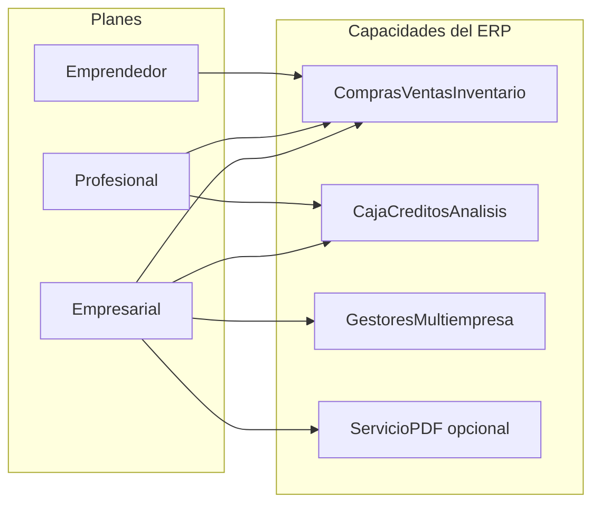
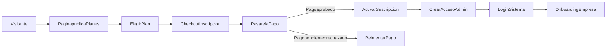
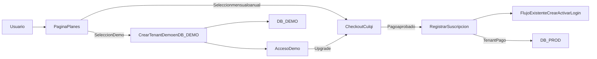
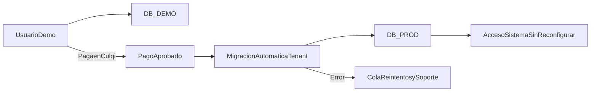

# Planes comerciales recomendados (revisión del sistema)

## Contexto del producto (lo revisado en el repo)

Según [documentacion/README_SISTEMA_COMPLETO.md](documentacion/README_SISTEMA_COMPLETO.md) y el mapa de implementación en [documentacion/FALTA_POR_IMPLEMENTAR.md](documentacion/FALTA_POR_IMPLEMENTAR.md), el sistema es un **gestor empresarial multiempresa y multiusuario** con: registro/onboarding con **RUC y SUNAT**, **roles y colaboradores**, **productos** (categorías, marcas, impuestos, listas de precio, compuestos), **clientes y proveedores**, **sucursales**, **compras y ventas**, **inventario y lotes** (incl. ubicaciones), **caja**, **créditos y cuotas**, **análisis** y **reportes**, además de **gestión de empresas** y **gestores** (empresas que administran otras). La documentación de despliegue menciona servicios adicionales como **pdf-backend** (generación PDF) como pieza opcional de arquitectura.

Esa base permite **segmentar por límites operativos** (usuarios, sucursales, volumen de maestros/transacciones) y por **módulos avanzados** (créditos, análisis profundo, multi-empresa vía gestores, soporte/SLA), no solo por “tener el mismo software con distinto precio”.

---

## Principios de diseño de los 3 planes

- **Emprendedor:** una sola operación simple, pocos usuarios, una sucursal; foco en **compras + ventas + inventario básico + catálogos**.
- **Profesional:** operación establecida con equipo; **todos los módulos core** del sistema (incl. caja, créditos, reportes y análisis) con límites medios.
- **Empresarial:** varias sucursales y/o varias razones sociales gestionadas, más usuarios, necesidades de **gobernanza, soporte y escalabilidad** (incl. encaje con servicios tipo PDF/infra dedicada si los ofreces comercialmente).

**Facturación:** ofrecer **mensual** (flexible) y **anual** (compromiso); descuento anual típico equivalente a **~2 meses gratis** (~17% sobre 12× mensual), redondeado a precios “limpios” en PEN.

**Moneda:** precios sugeridos en **PEN (S/)** por el contexto SUNAT/RUC del producto. Son **orientativos**: conviene contrastarlos con competidores locales y con tu costo de hosting/soporte.

---

## 1) Plan Emprendedor

**Perfil:** microempresa, dueño + 1 ayudante, un solo local.

**Incluye (propuesta de alcance comercial):**

- 1 **empresa** (tenant) y **1 sucursal**.
- **Hasta 3 usuarios** colaboradores (además del admin).
- **Onboarding SUNAT** (RUC, datos empresa) y configuración básica.
- Módulos: **productos** (categorías/marcas/impuestos), **clientes**, **proveedores**, **compras**, **ventas**, **inventario/lotes** en alcance **estándar** (sin funciones marcadas como “premium” si las defines después).
- **Reportes esenciales** (ventas/compras/stock resumido); **análisis financiero** opcional restringido o solo vistas básicas (para empujar upgrade a Profesional).
- **Soporte:** email/tickets, tiempo de respuesta estándar (p. ej. 48–72 h hábiles).

**Límites sugeridos (para costos y upsell):**

- Hasta **500 productos activos** y/o **300 documentos/mes** (compras+ventas); ajustar según costo de BD y uso real.

**Precios sugeridos (PEN):**

| Periodicidad | Precio sugerido | Nota |
|----------------|-----------------|------|
| Mensual | **S/ 59** / mes | Entrada accesible para micro |
| Anual | **S/ 590** / año | ~S/ 49,2/mes efectivo (~17% vs 12×59) |

---

## 2) Plan Profesional

**Perfil:** PYME con equipo (ventas, almacén, contabilidad operativa), varias ubicaciones moderadas.

**Incluye:**

- **1 empresa**, **hasta 3 sucursales**.
- **Hasta 10 usuarios**.
- Todo lo del Emprendedor más: **caja**, **créditos y cuotas**, **análisis** y **reportes** completos según lo que ya expone el sistema.
- **Listas de precio** y escenarios de venta más complejos (alineado a tablas `ListasPrecio` / `PreciosProducto` ya contempladas en el esquema).
- **Soporte:** prioridad media (p. ej. 24–48 h), acceso a base de conocimiento / guías ([GUIA_ONBOARDING_EMPRESA](documentacion/GUIA_ONBOARDING_EMPRESA.md), etc.).

**Límites sugeridos:**

- Hasta **5.000 productos activos** y/o **2.000 documentos/mes**; o límites por almacenamiento de adjuntos si aplica.

**Precios sugeridos (PEN):**

| Periodicidad | Precio sugerido | Nota |
|----------------|-----------------|------|
| Mensual | **S/ 149** / mes | “Sweet spot” PYME |
| Anual | **S/ 1.490** / año | ~S/ 124/mes efectivo |

---

## 3) Plan Empresarial

**Perfil:** operación con varias sucursales, más usuarios, o **grupo / gestoría** que administra varias empresas (encaja con **Gestores_Empresas** del modelo).

**Incluye:**

- **Sucursales:** desde **10** o “ilimitadas con fair use” (define política anti-abuso).
- **Usuarios:** **30+** o paquetes de +10 usuarios con add-on.
- Uso de **gestores / multi-empresa** (si lo comercializas solo aquí, diferencia fuerte vs otros planes).
- **Soporte prioritario** (p. ej. &lt; 24 h en horario laboral), **onboarding guiado** (1–2 sesiones), posibilidad de **ventana de mantenimiento acordada**.
- Si ofreces **pdf-backend** u otro servicio dedicado: incluirlo como “**generación PDF / documentos** con infraestructura aislada” o SLA de disponibilidad.
- Opcional comercial: **marca blanca** (logo/dominio), **exportaciones avanzadas**, **ambiente de pruebas** (staging).

**Límites sugeridos:**

- Productos y documentos altos o **a medida**; revisión anual de uso.

**Precios sugeridos (PEN):**

| Periodicidad | Precio sugerido | Nota |
|----------------|-----------------|------|
| Mensual | **S/ 399** / mes | Base; multi-empresa suele justificar más |
| Anual | **S/ 3.990** / año | ~S/ 332,5/mes efectivo |

**Add-ons (recomendado):** paquetes de **+5 usuarios**, **+1 empresa adicional** bajo gestor, **horas de implementación** (catálogo inicial, capacitación).

---

## Cómo comunicar la diferencia (mensaje corto para web)

- **Emprendedor:** “Empezá a facturar y controlar stock sin fricción.”
- **Profesional:** “Equipo completo: caja, créditos y análisis para crecer ordenado.”
- **Empresarial:** “Varias sucursales o varias empresas bajo control, con soporte y escala.”

---

## Implementación técnica (futura, no requerida para esta propuesta comercial)

Hoy el código no modela `plan`/`límites` en JWT; cuando quieras cobrarlo en producto, habría que añadir **tabla de suscripción por empresa**, **middleware de cuotas** (usuarios, sucursales, documentos) y **feature flags** por plan, respetando siempre `idEmpresa` desde token según tus reglas de backend.

---

## Resumen de precios sugeridos

| Plan | Mensual (PEN) | Anual (PEN) | Descuento anual aprox. |
|------|---------------|-------------|-------------------------|
| Emprendedor | S/ 59 | S/ 590 | ~17% vs mensual |
| Profesional | S/ 149 | S/ 1.490 | ~17% |
| Empresarial | S/ 399 | S/ 3.990 | ~17% |

**Validación:** comparar con 2–3 ERP/contabilidad/inventario SaaS Perú; ajustar **±20%** según posicionamiento (más valor en vertical SUNAT + lotes + multiempresa).

---

## Extensión solicitada: página pública + pago + acceso

Se agrega al plan una línea de implementación para que el sistema tenga un embudo completo: **ver planes -> pagar inscripción -> acceder al sistema**.

### 1) Página pública de planes

- **Ruta pública web:** crear una vista pública tipo `/planes` (o `/pricing`) fuera del área autenticada.
- **Contenido:** tarjetas de `Emprendedor`, `Profesional`, `Empresarial`, switch mensual/anual, lista de beneficios, límites, add-ons y preguntas frecuentes.
- **CTA por plan:** `Elegir plan` debe llevar al flujo de checkout con el plan preseleccionado.
- **Credibilidad comercial:** incluir “prueba social” (testimonios/logos), políticas (renovación/cancelación) y contacto comercial.

### 2) Página de pago / inscripción

- **Ruta checkout:** `/suscribirse/:planId` (o similar), pública.
- **Datos mínimos del formulario:** RUC, razón social, email admin, celular, nombre comercial, contraseña inicial (o flujo “crear contraseña por correo”).
- **Integración de pago:** pasarela local (ej. Culqi/Niubiz/MercadoPago) con webhooks para confirmar estado real de pago.
- **Estados de UX:** pendiente, aprobado, rechazado, reintento; pantalla de confirmación con detalle de plan y fecha de renovación.

### 3) Activación y acceso al sistema

- Tras pago aprobado, crear `empresa + suscripción + usuario administrador` (si no existían) y asignar `plan`.
- Generar acceso inmediato: botón `Ir al sistema` (login) y envío de correo de bienvenida con credenciales/enlace seguro.
- Primer ingreso redirigido al onboarding de empresa para completar configuración inicial.
- Si el pago queda pendiente, permitir reanudar checkout sin perder datos.

### 4) Cambios de arquitectura recomendados (backend/frontend)

- **Backend (`backAppC`)**
  - Nuevas entidades: `Planes`, `Suscripciones`, `Pagos`, `HistorialSuscripcion`.
  - Endpoints públicos: catálogo de planes, creación de checkout, webhook de pasarela, confirmación de pago.
  - Endpoints privados: estado de suscripción de la empresa, upgrade/downgrade, renovación/cancelación.
  - Middleware de suscripción activa para rutas de negocio (sin romper tu regla de `idEmpresa` desde JWT).
- **Frontend (`adminSPA`)**
  - Módulo público `public/planes` y `public/checkout`.
  - Servicio de suscripción/pagos y guard de acceso según estado de plan.
  - Pantallas de resultado de pago y recuperación de checkout.

### 5) Roadmap por fases (MVP a producción)

- **Fase 1 (MVP comercial):** landing de planes + checkout manual/semiautomático + alta interna de suscripción.
- **Fase 2 (automatización):** pasarela integrada con webhooks y activación automática.
- **Fase 3 (escala):** upgrades/downgrades self-service, prorrateo, recordatorios de cobro y suspensión por mora.

---

## Ajuste solicitado: usar flujo existente + Culqi directo

El sistema **ya tiene** `crear empresa`, `activar por código` e `ingresar`. Por eso, la propuesta se ajusta a **reutilizar lo que ya funciona** y no crear un onboarding paralelo.

### 1) Comportamiento de la página de planes (simplificado)

- La página pública de planes muestra:
  - `Emprendedor`, `Profesional`, `Empresarial`, `Demo`.
  - selector de modalidad: `Mensual` o `Anual` (excepto Demo).
- El botón `Elegir` **no crea empresa** ni registro nuevo.
- Solo redirige a **checkout Culqi** con:
  - `planId`
  - `billingCycle` (`monthly` o `yearly`)
  - monto final ya calculado.

### 2) Flujo recomendado sin duplicar tu onboarding

- Paso 1: usuario ve planes y paga en Culqi.
- Paso 2: webhook/aprobación de pago registra pre-suscripción.
- Paso 3: se envía/expone enlace para continuar con tu flujo existente:
  - `crear empresa` (si aún no existe),
  - `activar por código`,
  - `login`.
- Si la empresa ya existe y está activada, se actualiza solo su suscripción y accede directo al sistema.

### 3) Mensual vs anual en Culqi

- Crear productos/precios en Culqi por combinación:
  - `emprendedor_monthly`, `emprendedor_yearly`
  - `profesional_monthly`, `profesional_yearly`
  - `empresarial_monthly`, `empresarial_yearly`
- En backend guardar siempre:
  - `planCode`,
  - `billingCycle`,
  - `amount`,
  - `culqiChargeId`,
  - `nextBillingDate`.
- Regla comercial:
  - anual con descuento,
  - mensual sin permanencia.

### 4) Plan Demo (recomendación de uso)

- Objetivo: reducir fricción y acelerar conversión.
- Duración sugerida: **7 a 14 días**.
- Alcance sugerido:
  - 1 empresa demo,
  - 1 sucursal,
  - hasta 2 usuarios,
  - límite bajo de documentos,
  - sin funciones avanzadas (o parcialmente limitadas).
- Conversión:
  - al vencer demo, bloquear operaciones transaccionales y mostrar CTA a Culqi.
  - permitir upgrade a plan pagado conservando configuración si cumple políticas.

### 5) Base de datos demo vs base de datos de pago

Recomendación: **sí separar** ambientes de demo y suscripción pagada.

- **Opción recomendada (más segura):**
  - `DB_DEMO` para tenants demo.
  - `DB_PROD` para tenants con pago activo.
  - misma estructura de tablas, credenciales y backups separados.
- Beneficios:
  - aislamiento de carga y pruebas de usuarios demo,
  - menor riesgo de mezclar datos de clientes reales,
  - políticas distintas de limpieza/retención.
- Operativa:
  - tenants demo se crean en `DB_DEMO`.
  - al convertir a pago, migrar tenant a `DB_PROD` con proceso controlado.
  - si no migras automáticamente al inicio, alternativa: obligar crear empresa definitiva en prod tras pago.

### 6) Fases ajustadas

- **Fase 1:** página de planes + redirección a checkout Culqi por mensual/anual.
- **Fase 2:** integración webhook Culqi y sincronización de suscripción con flujo existente (activar/login).
- **Fase 3:** plan demo con expiración y aislamiento en `DB_DEMO`.
- **Fase 4:** migración demo -> pago automatizada y métricas de conversión.

---

## Aclaración estratégica: ¿demo con migración o sin demo?

Tu observación es correcta: **si el usuario ya cargó productos y registró ventas en demo, obligarlo a rehacer todo reduce conversión** y genera frustración.

### Recomendación principal del plan

- **Mantener Plan Demo**, pero con **migración automática a producción** al pagar.
- No recomendar “demo desechable” sin migración, porque castiga al usuario justo cuando está listo para comprar.

### Cómo queda la política recomendada

- `DB_DEMO` y `DB_PROD` se mantienen separadas por seguridad y operación.
- Al confirmar pago en Culqi:
  - se ejecuta un proceso automático de migración del tenant demo a `DB_PROD`,
  - se conserva configuración y datos operativos (productos, clientes, proveedores, compras, ventas, lotes, caja, etc.),
  - se marca el tenant demo como migrado/bloqueado para evitar doble escritura.
- Si la migración falla:
  - no se pierde información,
  - se reintenta automáticamente,
  - se habilita cola de recuperación manual con trazabilidad.

### Cuándo sí considerar “sin demo”

Solo si decides un modelo comercial diferente (por ejemplo, “7 días de garantía de devolución” en plan pagado) y quieres simplificar operación.  
En ese escenario:
- reduces complejidad técnica (sin migración),
- pero normalmente baja la captación de leads fríos.

### Decisión propuesta para este sistema

- **Opción elegida en este plan:** `Demo + migración automática`.
- Motivo: mejor equilibrio entre captación, experiencia de usuario y continuidad de datos.

